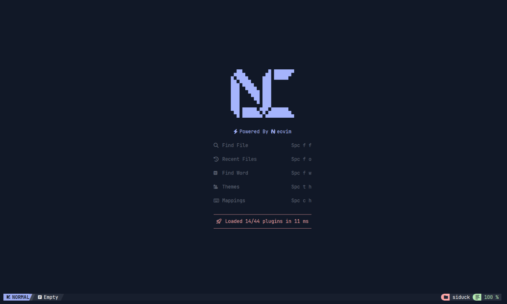
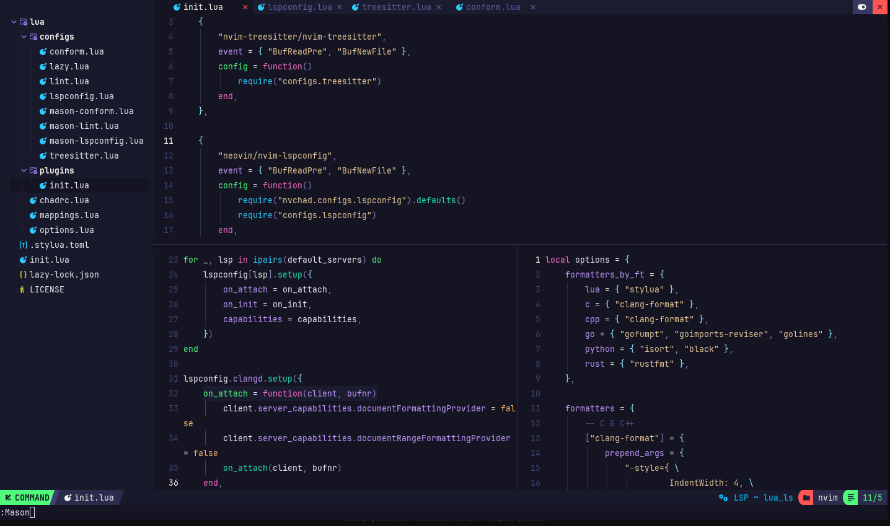
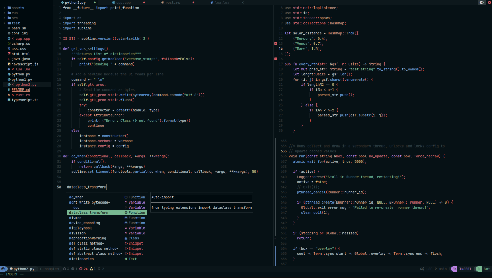

# Neovim Essentials by D1GG0

### Showcase

---

### About

---

This custom Neovim setup, built on the modular framework **NvChad**, provides comprehensive support for **C/C++**, **Assembly**, **Rust**, **Odin**, **Go**, **Python**, and **Lua** programming languages.

Structured primarily in Lua, this environment is designed to offer a **minimalist**, **functional**, and **extensible foundation**, focusing on **performance**, **readability**, and **modular architecture**.

The core objective of this configuration is to serve as a **robust** and **customizable starting point**, facilitating seamless expansion and adaptation to meet specific project requirements or developer workflows.
It integrates modern features such as **LSP (Language Server Protocol)**, **linters**, **code formatters**, and **intelligent autocompletion**, fostering a productive and scalable terminal-based development experience.

## Setup on Arch Linux

---

### Backup and Remove Old Nvim Config

---

Backup old nvim config.

	mv ~/.config/nvim ~/.config/nvim-old

Or remove old nvim config.

	rm -rf ~/.config/nvim

Remove local/state and local/share

	rm -rf ~/.local/state/nvim
	rm -rf ~/.local/share/nvim

### Installation

---

Install required packages.

	sudo pacman -S --needed neovim unzip luarocks xclip wl-clipboard

Install the setup.

	git clone https://github.com/d1gg0-dev/neovim-essentials.git ~/.config/nvim && nvim

You can safely remove the .git and image files.

	rm -rf ~/.config/nvim/.gitignore
	rm ~/.config/nvim/*.png

#### Post-Installation

---

Once all plugins have been downloaded and synchronized by lazy.nvim, execute the following command within Neovim to install all registered Language Servers, linters, and formatters:

	:MasonInstallAll

To learn more about customizing the UI and theming system (base46) used by NvChad, refer to the internal Neovim documentation:

	:h nvui
 
To force plugin re-synchronization when necessary, use:

	:Lazy sync

#### Complete Uninstallation

---

To fully remove the Neovim setup, including configurations, plugins, and persistent states, execute the following commands:

	rm -rf ~/.config/nvim
	rm -rf ~/.local/share/nvim
	rm -rf ~/.local/state/nvim

**Warning:** This operation is irreversible and will permanently delete all Neovim customizations and user data.

### Requirements

---

**Step 1. System Update and Base Development Tools**

	sudo pacman -Syu base-devel git curl wget unzip

**Step 2. C/C++ Support (Clang Compiler)**

	sudo pacman -S clang

**Step 3. Python Support**

	sudo pacman -S python python-pip

**Step 4. Golang Support**

	sudo pacman -S go

**Step 5. Odin Language Support**

	sudo pacman -S odin

**Step 6. Rust Installation**

	curl --proto '=https' --tlsv1.2 -sSf https://sh.rustup.rs | sh

**Step 7. Rust Update and Component Installation**

	rustup update
	rustup component add rust-analyzer clippy

**Step 8. Assembly Language Support**

	sudo pacman -S nasm

**Step 9. Lua Tooling**

	sudo pacman -S stylua luacheck

**Step 10. Neovim Installation**

	sudo pacman -S neovim

**Step 11. Auxiliary Dependencies (Clipboard, LuaRocks, etc.)**

	sudo pacman -S --needed neovim unzip luarocks xclip wl-clipboard

**Step 12. Defensive Redundancy (Recommended for Automation Scripts)**

	sudo pacman -S --needed rustup nasm base-devel

### Technical References

---

For further technical insight into NvChad’s architecture and recommended practices, consult the following official resources:

[NvChad Official Documentation](https://nvchad.com/docs/quickstart/install)

[NvChad Main Repository](https://github.com/NvChad/NvChad)

[Community Fork: NvChad 2.5 by ProgrammingRainbow](https://github.com/ProgrammingRainbow/NvChad-2.5)
